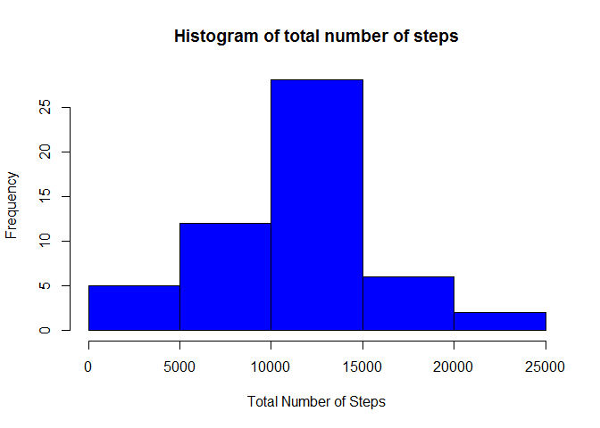
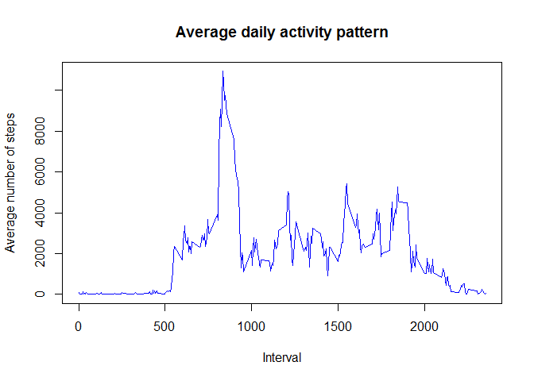
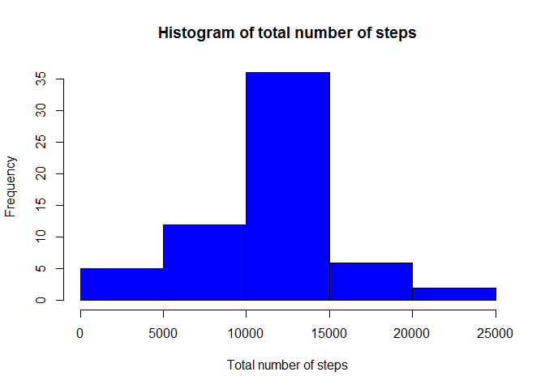
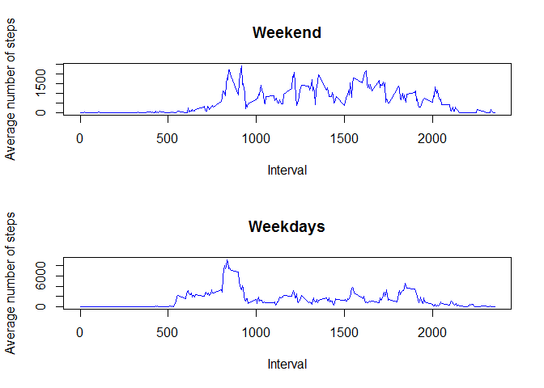

# Reproducible Research: Peer Assessment 1

## Loading and preprocessing the data

```r
  # Read csv file from current folder to load the data
  data <- read.csv('activity.csv',colClasses=c('numeric','character','numeric'), stringsAsFactors = FALSE)
```

## What is mean total number of steps taken per day?

```r
  # Ploting histogram, calculating mean and median
  aggregatedData <- aggregate(data$steps,by=list(data$date),sum )
  hist(aggregatedData$x,col='blue',xlab='Total Number of Steps',main='Histogram of total number of steps')
```

<!-- -->

```r
  # Calculating mean and median
  cat("Mean =",as.character(mean(aggregatedData$x,na.rm=T)))
```

```
## Mean = 10766.1886792453
```

```r
  cat("Mean =",median(aggregatedData$x,na.rm=T))
```

```
## Mean = 10765
```

## What is the average daily activity pattern?

```r
  # Aggragate data by interval and plot the results
  aggregatedData <- aggregate(data$steps,by=list(data$interval),function(x) sum(x,na.rm=T) )
  plot(aggregatedData$Group.1,aggregatedData$x,type='l',xlab="Interval",ylab="Average number of steps",col='blue',main="Average daily activity pattern")
```

<!-- -->

```r
  cat("Max Interval =",aggregatedData[order(aggregatedData$x,decreasing=T),][1,1])
```

```
## Max Interval = 835
```

## Imputing missing values

```r
  # Load library
  library(plyr)

  # Calculate total number of NA values
  cat("Total number of missing values =",sum(is.na(data$steps)))
```

```
## Total number of missing values = 2304
```

```r
  # Define imputing function and applying the imputing function on data group by interval
  inpute <- function(x) ifelse (is.na(x),mean(x, na.rm = TRUE),x)
  
  # Assigning imputed date to new variable
  dataNew <- ddply(data,~interval, transform, steps = inpute(steps) )
  
  # Ploting the histogram
  aggregatedData <- aggregate(dataNew$steps,by=list(dataNew$date),sum )
  hist(aggregatedData$x,col='blue',xlab='Total number of steps',main='Histogram of total number of steps')
```

<!-- -->

```r
  # Calculating mean and median
  cat("Mean =",as.character(mean(aggregatedData$x,na.rm=T)))
```

```
## Mean = 10766.1886792453
```

```r
  cat("Median =",median(aggregatedData$x,na.rm=T))
```

```
## Median = 10766.19
```

## Are there differences in activity patterns between weekdays and weekends?

```r
  # Create a new factor indicates weekend
  data$weekend <- weekdays(as.Date(data$date,"%Y-%m-%d")) %in% c("Saturday" ,"Sunday" )
  data$weekend <- as.factor(ifelse(data$weekend, "weekend","weekday"))

  # Split data by weekend/weekday
  splittedData <- split(data, data$weekend)
  weekendData <- splittedData[["weekend"]]
  weekdayData <- splittedData[["weekday"]]
  
  # Ploting each subset by base graphics system 
  par(mfrow = c(2, 1))
  aggregatedData <- aggregate(weekendData$steps ,by=list(weekendData$interval),function(x) sum(x,na.rm=T) )
  plot(aggregatedData$Group.1,aggregatedData$x,type='l',xlab="Interval",ylab="Average number of steps",col='blue',main="Weekend")
  aggregatedData <- aggregate(weekdayData$steps ,by=list(weekdayData$interval),function(x) sum(x,na.rm=T) )
  plot(aggregatedData$Group.1,aggregatedData$x,type='l',xlab="Interval",ylab="Average number of steps",col='blue',main="Weekdays")
```

<!-- -->

